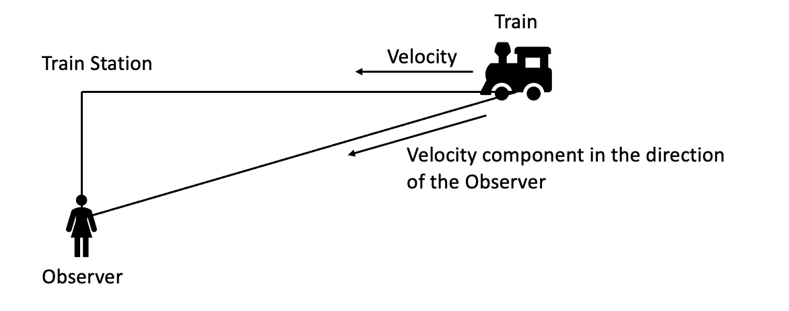

# doppler_effect

## Doppler Math

## Running the Simulation
open the file `doppler_effect.html` in a browser and press the `Start!` button to start the Simulation 

## Running the tests
the test folder is used to record some of the audio effects of the simulation. To run the tests, open the file `test_audio_filters.html` in a browser and press the different buttons to record teh effect. the audio is saved withint the <audio> object. right click on the audio and select `save audio as` to save the audio file.

